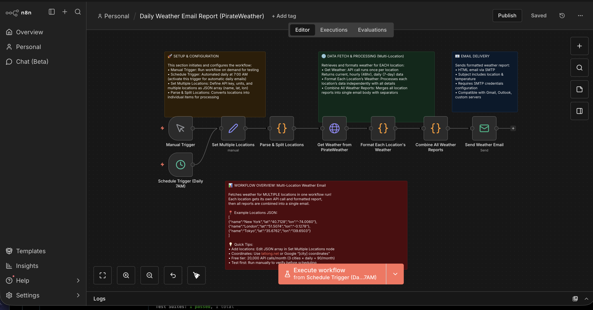

# n8n Weather Email Workflow

**Author:** Roy Kim - Customized Code
**License:** MIT
**Version:** 2.0.0

An n8n workflow that automatically fetches detailed weather information using the PirateWeather API and sends a beautifully formatted weather report via email.

## Overview

This workflow provides a comprehensive weather reporting solution delivered straight to your inbox. It uses the PirateWeather API (a free, open-source alternative to Dark Sky) to fetch accurate weather data and sends beautifully formatted HTML emails via SMTP.

## Features

- **Multi-Location Support**: Fetch weather for multiple cities in a single workflow run
- **Manual & Scheduled Triggers**: Run on demand or automatically daily at 7:00 AM
- **Configurable Variables**: Easy-to-customize locations array, API key, and units
- **Comprehensive Weather Data**: Current conditions, 6-hour forecast, daily high/low, humidity, wind, UV index, and more
- **Professional HTML Emails**: Beautiful gradient design with organized sections and emoji icons
- **Multiple Unit Systems**: Support for US, SI (metric), CA (Canadian), and UK units
- **Free API**: PirateWeather offers generous free tier (20,000 calls/month)
- **SMTP Support**: Works with any SMTP email provider (Gmail, Outlook, custom servers, etc.)

## Testing

This workflow includes a comprehensive structural validation test suite with 56 tests that verify the workflow configuration, node structure, and connections.

For complete testing documentation, see **[TESTING.md](TESTING.md)**.

**Quick Start:**

```bash
npm install
npm test
```

**Key Features:**

- 56 passing structural validation tests
- Validates workflow metadata, nodes, and connections
- No execution required - tests configuration only
- CI/CD ready

For detailed setup, test descriptions, and troubleshooting, refer to [TESTING.md](TESTING.md).

## Workflow Structure

```

Manual Trigger Set Multiple Parse & Split Get Weather from Format Each
Locations Locations PirateWeather Location's Weather


Schedule Trigger
(Daily 7AM) (joins above)


Send Weather Combine All Weather
Email Reports

```

### Nodes

1. **Manual Trigger** - Starts the workflow on demand for testing
2. **Schedule Trigger (Daily 7AM)** - Automatically runs workflow daily at 7:00 AM
3. **Set Multiple Locations** - Configurable variables (API key, units, and locations JSON array)
4. **Parse & Split Locations** - Splits the locations array into individual items for processing
5. **Get Weather from PirateWeather** - HTTP Request to fetch weather data (runs once per location)
6. **Format Each Location's Weather** - JavaScript Code node to process and format each location's data
7. **Combine All Weather Reports** - Merges all location reports into a single email body
8. **Send Weather Email** - SMTP email sender with combined weather reports

## Getting Started

### Prerequisites

- n8n instance (self-hosted or cloud)
- PirateWeather API key (free - get one at [pirate-weather.apiable.io](https://pirate-weather.apiable.io/))
- SMTP email credentials
- Basic understanding of n8n workflows

### Installation

1. **Download the workflow file**
```bash
# The workflow is saved as weather-email-workflow.json
```

2. **Get PirateWeather API Key**
- Visit [PirateWeather API Portal](https://pirate-weather.apiable.io/)
- Sign up for a free account
- Click **Subscribe** to the Forecast API
- Copy your API key (may take up to 20 minutes to activate)
- **Free tier**: 20,000 API calls per month

3. **Import into n8n**
- Open your n8n instance
- Navigate to **Workflows**
- Click **Import from File**
- Select `weather-email-workflow.json`
- Click **Import**

4. **Configure Workflow Variables**
- Open the **"Set Multiple Locations"** node
- Update the following variables:
- **apiKey**: Paste your PirateWeather API key
- **units**: Choose `us` (Imperial), `si` (Metric), `ca` (Canadian), or `uk` (UK)
- **locations**: JSON array of locations (see example below)
- Click **Save**

**Example locations configuration:**

```json
[
{
"name": "New York",
"lat": "40.7128",
"lon": "-74.0060"
},
{
"name": "Los Angeles",
"lat": "34.0522",
"lon": "-118.2437"
},
{
"name": "Chicago",
"lat": "41.8781",
"lon": "-87.6298"
}
]
```

5. **Configure SMTP Credentials**
- Click on the **"Send Weather Email"** node
- Click **Credentials** → **Create New**
- Enter your SMTP details:
- **User**: Your email address
- **Password**: Your email password or app-specific password
- **Host**: SMTP server (e.g., `smtp.gmail.com`)
- **Port**: SMTP port (e.g., `587` for TLS, `465` for SSL)
- **SSL/TLS**: Enable if required
- Click **Save**

6. **Update Email Addresses**
- Open the **"Send Weather Email"** node
- Update these fields:
- **From Email**: `your-email@example.com`
- **To Email**: `recipient@example.com`
- Click **Save**

7. **Test the Workflow**
- Click **Execute Workflow** button
- Check your inbox for the weather email

## Configuration

### Configuring Multiple Locations

To add, remove, or modify weather locations:

1. Open the **"Set Multiple Locations"** node
2. Edit the **locations** variable (JSON array format)
3. Each location must have three properties: `name`, `lat`, and `lon`
4. Click **Save**

**Adding a new location:**

```json
[
{
"name": "New York",
"lat": "40.7128",
"lon": "-74.0060"
},
{
"name": "London",
"lat": "51.5074",
"lon": "-0.1278"
},
{
"name": "Tokyo",
"lat": "35.6762",
"lon": "139.6503"
},
{
"name": "Sydney",
"lat": "-33.8688",
"lon": "151.2093"
}
]
```

**Single location setup:**

If you only want one location, use an array with one item:

```json
[
{
"name": "San Francisco",
"lat": "37.7749",
"lon": "-122.4194"
}
]
```

**Finding Coordinates:**

- Use [LatLong.net](https://www.latlong.net/) to find coordinates for any location
- Or search "latitude longitude [city name]" in your browser
- Format: latitude first, then longitude (e.g., `40.7128, -74.0060`)

**Important Notes:**

- The workflow makes **one API call per location** - be mindful of your free tier limit (20,000 calls/month)
- Example: 3 locations × daily execution = 90 API calls/month (well within free tier)
- Example: 10 locations × daily execution = 300 API calls/month (still safe)
- Keep locations list reasonable to avoid long execution times

### Changing Units

To change temperature and measurement units:

1. Open the **"Set Multiple Locations"** node
2. Update the **units** variable:
- `us` - Fahrenheit, miles, mph (Imperial)
- `si` - Celsius, kilometers, m/s (Metric)
- `ca` - Celsius, kilometers, km/h (Canadian)
- `uk` - Celsius, miles, mph (UK)
3. Click **Save**

Note: The units setting applies to **all locations** in the workflow.

### SMTP Provider Examples

#### Gmail
- **Host**: `smtp.gmail.com`
- **Port**: `587` (TLS) or `465` (SSL)
- **Security**: Enable TLS/SSL
- **Note**: You may need to create an [App Password](https://support.google.com/accounts/answer/185833)

#### Outlook/Office 365
- **Host**: `smtp.office365.com`
- **Port**: `587`
- **Security**: Enable STARTTLS

#### Custom SMTP Server
- Use your provider's SMTP settings
- Common ports: `25`, `465`, `587`, `2525`

### Customizing the Email Template

To modify the email design:

1. Open the **"Format Each Location's Weather"** node
2. Find the `htmlBody` section in the JavaScript code
3. Edit the HTML/CSS to customize:
- Colors
- Layout
- Font styles
- Additional sections

To customize the combined email format:

1. Open the **"Combine All Weather Reports"** node
2. Modify how multiple location reports are merged
3. Customize separators, headers, or overall email structure

Example customization:

```javascript
const htmlBody = `
<html>
<head>
<style>
body { font-family: 'Helvetica', sans-serif; background: #f0f0f0; }
/* Add your custom styles here */
</style>
</head>
<body>
<!-- Your custom HTML here -->
</body>
</html>
`;
```

## Advanced Configuration

### Adding Error Handling

To make the workflow more robust, consider adding:

1. **Retry on Failure**
- Open HTTP Request node
- Enable **"Retry On Fail"**
- Set retry attempts (e.g., 3)

2. **Error Trigger**
- Add an **Error Trigger** node
- Connect it to send error notifications

### Scheduling the Workflow

The workflow includes both manual and scheduled triggers:

- **Manual Trigger**: Run on demand for testing
- **Schedule Trigger (Daily 7AM)**: Automatically executes daily at 7:00 AM

To modify the schedule:

1. Open the **"Schedule Trigger (Daily 7AM)"** node
2. Update the cron expression:
- **Daily at 7:00 AM**: `0 7 * * *`
- **Daily at 9:00 AM**: `0 9 * * *`
- **Twice daily (7 AM & 7 PM)**: `0 7,19 * * *`
- **Every Monday at 8 AM**: `0 8 * * 1`
3. Click **Save**

To disable automatic scheduling:

- Simply deactivate the workflow in n8n (the Manual Trigger will still work)

## API Information

### PirateWeather API

- **Endpoint**: `https://api.pirateweather.net/forecast/[apikey]/[latitude],[longitude]`
- **Method**: GET
- **Authentication**: API key required (free tier: 20,000 calls/month)
- **Documentation**: [docs.pirateweather.net](https://docs.pirateweather.net/)

**Query Parameters**:

- `units`: Unit system (`us`, `si`, `ca`, `uk`)
- `exclude`: Exclude data blocks (optional)
- `extend`: Extend hourly forecast to 168 hours (optional)

**Response Data Blocks**:

- **currently**: Current weather conditions
- **hourly**: Hour-by-hour forecast (48 hours default, 168 with `extend=hourly`)
- **daily**: 7-day forecast with daily summaries
- **alerts**: Severe weather warnings
- **flags**: Metadata about data sources and units

**Weather Data Points**:

- Temperature (actual and feels-like)
- Humidity, precipitation probability and intensity
- Wind speed and gusts
- Cloud cover, UV index, visibility
- Atmospheric pressure
- Sunrise/sunset times, moon phase
- Weather icons and summaries

## Troubleshooting

### No Weather Data in Email

**Issue**: Email received but shows "Weather information not available"

**Solutions**:

1. Verify your PirateWeather API key is correct and activated (wait 20 minutes after signup)
2. Check if coordinates are valid (latitude: -90 to 90, longitude: -180 to 180)
3. Test the API directly in a browser:
```
https://api.pirateweather.net/forecast/YOUR_API_KEY/40.7128,-74.0060
```
4. Check n8n execution logs for specific error messages
5. Verify you haven't exceeded the free tier limit (20,000 calls/month)

### Email Not Sending

**Issue**: Workflow completes but no email is received

**Solutions**:
1. Verify SMTP credentials are correct
2. Check spam/junk folder
3. Enable "Allow less secure apps" if using Gmail
4. Use an app-specific password instead of your main password
5. Check n8n execution logs for error messages

### SMTP Connection Errors

**Issue**: "ECONNREFUSED" or "ETIMEDOUT" errors

**Solutions**:
1. Verify SMTP host and port are correct
2. Check if firewall is blocking outgoing SMTP connections
3. Try different ports (587, 465, 25)
4. Ensure SSL/TLS settings match your provider's requirements

### Workflow Fails to Import

**Issue**: Error when importing the JSON file

**Solutions**:
1. Ensure you're using n8n version 0.200.0 or higher
2. Check that the JSON file is valid (not corrupted)
3. Try copying the JSON content and using "Import from URL" with a paste service

## Alternative Weather APIs

If you need different features or data sources, consider these alternatives:

### Open-Meteo

- **Free**: No API key required
- **Endpoint**: `https://api.open-meteo.com/v1/forecast`
- **Features**: Temperature, precipitation, wind speed, detailed forecasts
- **Limit**: Unlimited for non-commercial use

### OpenWeatherMap

- **Free Tier**: 1,000 calls/day
- **Endpoint**: `https://api.openweathermap.org/data/2.5/weather`
- **Requires**: API key (free signup)
- **Features**: Current weather, forecasts, historical data

### Weather.gov (US Only)

- **Free**: No API key required
- **Endpoint**: `https://api.weather.gov/`
- **Limitation**: US locations only
- **Features**: Detailed forecasts, alerts from NOAA

### Visual Crossing Weather

- **Free Tier**: 1,000 calls/day
- **Endpoint**: `https://weather.visualcrossing.com/`
- **Requires**: API key (free signup)
- **Features**: Historical, current, and forecast data

## Workflow Validation

The workflow has been validated and includes:
- All required node parameters configured
- Proper node connections
- Valid n8n expressions
- Correct return formats
- Consider adding error handling for production use

## Contributing

To improve this workflow:

1. Fork or copy the workflow
2. Make your enhancements
3. Test thoroughly
4. Share your improvements

## License

This workflow is licensed under the MIT License - see the [LICENSE](LICENSE) file for details.

Copyright (c) 2026 Roy Kim - Customized Code

Permission is hereby granted, free of charge, to any person obtaining a copy of this software and associated documentation files (the "Software"), to deal in the Software without restriction, including without limitation the rights to use, copy, modify, merge, publish, distribute, sublicense, and/or sell copies of the Software.

## Resources

- [n8n Documentation](https://docs.n8n.io/)
- [PirateWeather API Documentation](https://docs.pirateweather.net/)
- [PirateWeather API Portal](https://pirate-weather.apiable.io/)
- [PirateWeather GitHub](https://github.com/Pirate-Weather/pirateweather)
- [n8n Community Forum](https://community.n8n.io/)
- [n8n PirateWeather Integration](https://n8n.io/integrations/pirate-weather/)
- [SMTP Configuration Guide](https://docs.n8n.io/credentials/smtp/)

## Support

For issues or questions:
- Check the troubleshooting section above
- Review n8n's community forum
- Check execution logs in n8n for detailed error messages

## Future Enhancements

Potential improvements to consider:

- [x] Support multiple locations in one workflow run
- [x] Schedule trigger for automated daily emails
- [ ] Add weather icons based on conditions
- [ ] Include 5-day forecast in email
- [ ] Support multiple recipient emails
- [ ] Include weather alerts/warnings
- [ ] Add charts/graphs for weather trends
- [ ] Support SMS notifications as alternative
- [ ] Create dashboard view option
- [ ] Add HTML email template for combined reports

---

**Created**: 2026-01-05
**n8n Version**: Compatible with 0.200.0+
**Workflow File**: `weather-email-workflow.json`
